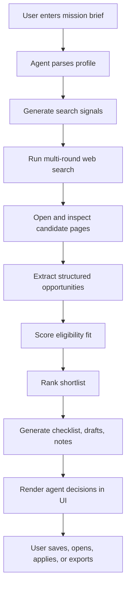
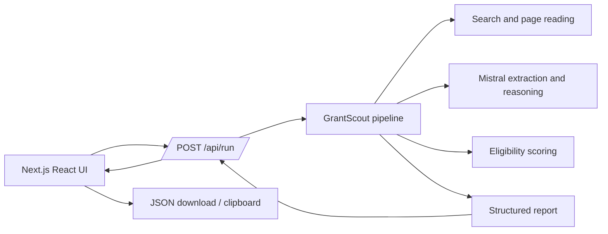
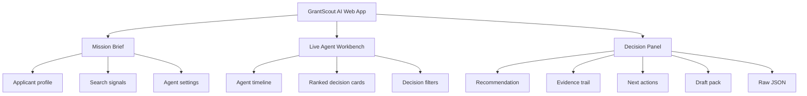
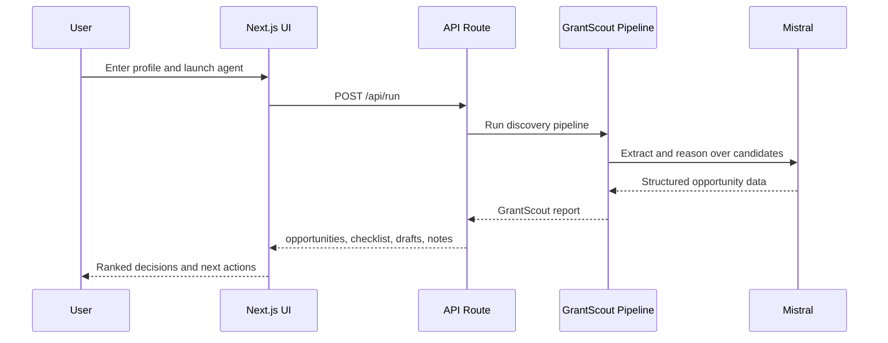
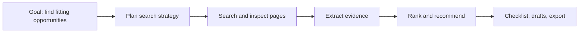

# GrantScout AI

GrantScout AI is an agentic grant discovery app. It turns a user profile into a ranked shortlist of grants, fellowships, scholarships, startup credits, and related funding opportunities.

The app does more than collect search results. It runs a multi-step workflow: understands the applicant, plans search signals, reads sources, extracts structured opportunity data, ranks matches, and prepares next actions like checklists, drafts, evidence, and JSON exports.

## Features

- Agent-style mission brief for applicant profile, location, status, and interests
- Multi-round grant/opportunity discovery
- Structured extraction of opportunity details
- Eligibility scoring and ranking
- Evidence trail from source pages
- Requirements and deadline extraction
- Application checklist generation
- Draft answer generation
- Saved shortlist and JSON export
- Next.js web UI with an agent workbench experience

## Tech Stack

- Next.js App Router
- React
- TypeScript
- Tailwind CSS
- Mistral API
- Zod-style structured data validation in the pipeline

## Agent Workflow



## System Architecture



## UI Concept



## Data Flow



## Report Shape

The app produces a structured report with:

```ts
type GrantScoutReport = {
  opportunities: Opportunity[];
  checklist: string[];
  drafts: Record<string, string>;
  notes: string[];
};
```

Each opportunity includes fields such as:

- `name`
- `type`
- `official_link`
- `application_link`
- `deadline`
- `requirements`
- `eligibility_score`
- `eligibility_reason`
- `evidence`

## Getting Started

Install dependencies:

```bash
npm install
```

Create a local environment file:

```bash
cp .env.example .env.local
```

Add your API key:

```bash
MISTRAL_API_KEY=your_key_here
```

Run the development server:

```bash
npm run dev
```

Open:

```text
http://localhost:3000
```

## Scripts

```bash
npm run dev
npm run build
npm run start
npm run lint
```

## How To Use

1. Enter a short applicant profile.
2. Add search signals such as AI, research, nonprofit, startup credits, or scholarships.
3. Set location and applicant status.
4. Launch the agent.
5. Review the ranked decision cards.
6. Open evidence, requirements, tasks, drafts, or raw JSON from the decision panel.
7. Save strong matches and export the shortlist.

## What Makes It Agentic?

GrantScout AI is agentic because the system performs a goal-driven workflow rather than a single prompt response.



## Project Structure

```text
grantscout-ai/
  src/
    app/
      api/run/route.ts     API endpoint for running the agent
      globals.css          App styling
      layout.tsx           Root layout
      page.tsx             Agentic UI
    lib/
      pipeline.ts          Discovery and report pipeline
      types.ts             Shared TypeScript types
  grantscout/              Python pipeline modules
  package.json
  README.md
```

## Notes

- Do not commit API keys.
- Use `.env.local` for local development.
- Use deployment provider environment variables for production.
- Always verify official eligibility rules before applying.

